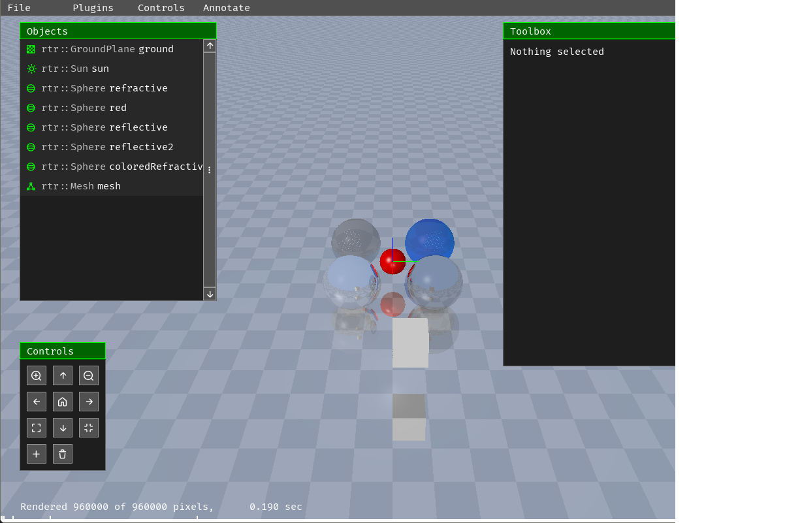
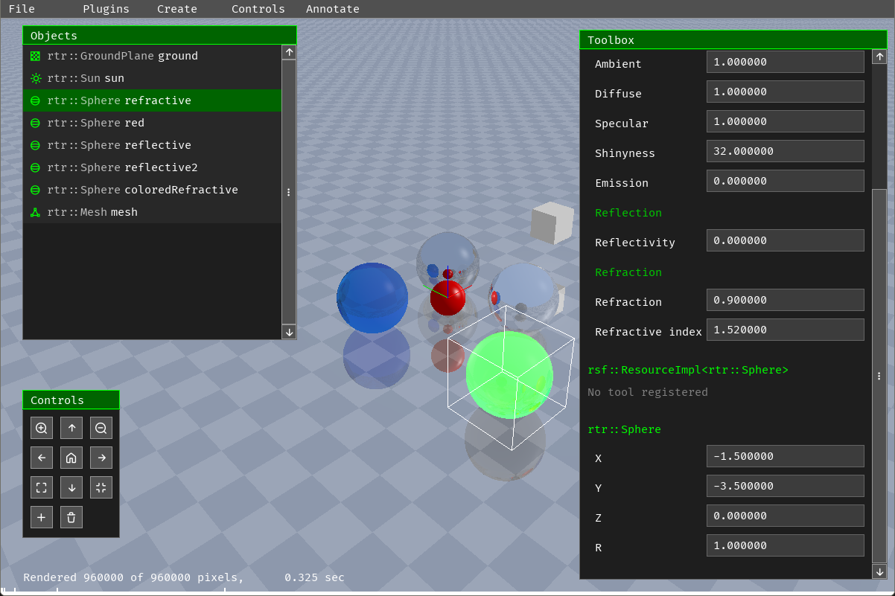
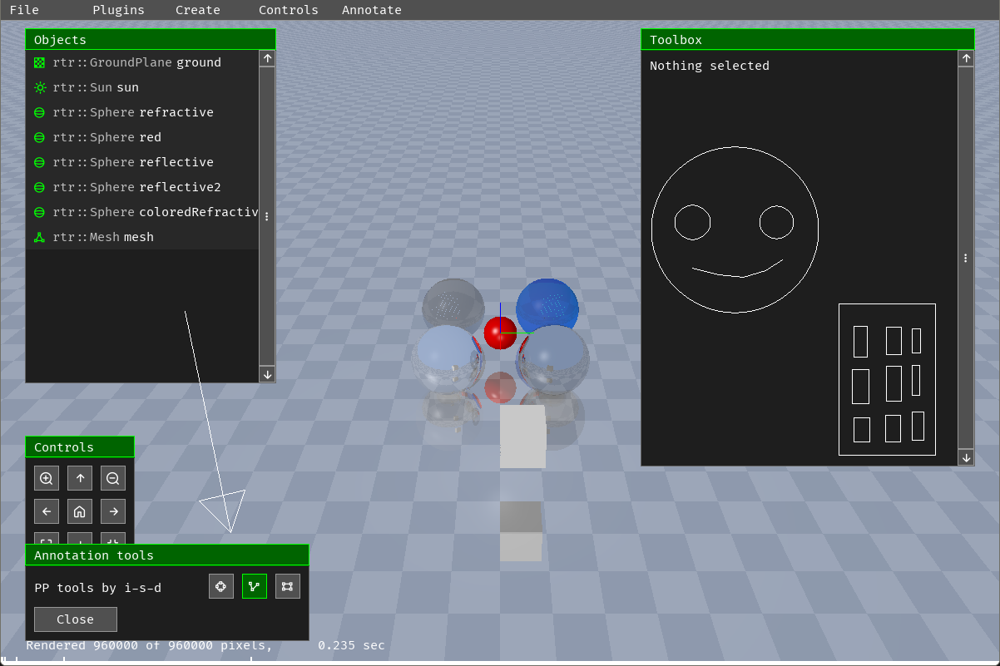
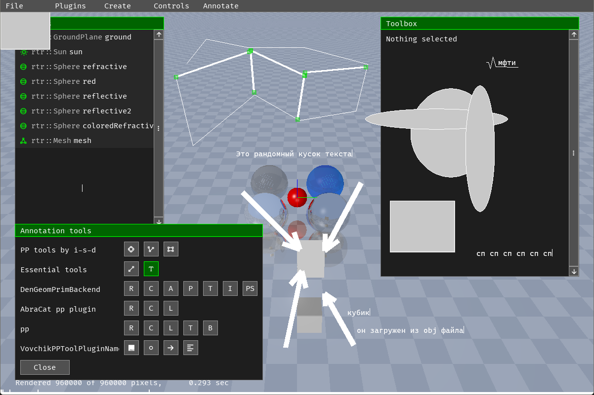

# `optics` -- рейтрейсер с редактором сцены, аннотацией и плагинами

Это учебный проект с 3-го семестра курса по C/C++ Дединского
в МФТИ на ФПМИ ИВТСП. Он был групповой -- данная программа 
поддерживает плагины, написаные по [общему стандарту](https://github.com/random-username-here/mipt-ded-zemax),
составленному всей группой. Я был кем-то вроде главы/мейнтейнара по написанию
этого стандарта. Основа стандарта была написана так: я писал на семинаре
на ноутбуке заголовочники, экран демонстрировался на проекторе. Там где
мнения расходились, обсуждали.

Данный репозиторий содержит мою программу, использующую этот стандарт.


## Как запустить

Для запуска потребуются:

 - `cmake`, чтобы собрать
 - `sdl2`, для интерфейса
 - `g++`, чтобы скомпилировать. Программа использует itaniium c++ abi для
     небольшой рефлексии, и компилировалась на g++. Я не знаю, заведётся ли она на `clang`-е.

```sh
$ git clone git@github.com:random-username-here/mipt-ded-optics.git
$ cd mipt-ded-optics
mipt-ded-optics/ $ git submodule update --init --recursive
mipt-ded-optics/ $ cmake -B build
mipt-ded-optics/ $ cd build/
mipt-ded-optics/build/ $ make
mipt-ded-optics/build/ $ ./ln/lenses . # запускает программу, грузит все собранные плагины
```

Выглядеть программа будет примерно так:



## Краткий обзор фич

Итак, что имеется:

На сцене различные объекты -- плоскость, шарики, модельки из `.obj` файлов.

C помощью левой кнопки мыши их можно выбирать. С помощью средней -- вращать камеру.
Правая двигает камеру. Можно приближать/удалять камеру прокруткой.

Есть окошко "Controls". Там имеется:

 - Приближение/удаление камеры -- кнопки с лупой
 - Вращение камеры по горизонтали/вертикали: стрелочки
 - Увеличение/уменьшение угла обзора: иконки свернуть/развернуть
 - Возврат в "положение по умолчанию": домик
 - Создание новой сферы: плюс
 - Удаление выделенных объектов: корзина

Список всех объектов выведен в окне "Objects". В нём их можно выбирать.

Окно "Toolbox" позволяет редактировать свойства выбранного объекта.
В этом окне редактируются свойства не только класса объекта, 
но и свойства его родительских классов, и так далее.

Например, для сферы там есть свойства `rtr::Object`-а (базовый класс
для всех объектов на сцене), и свойства именно `rtr::Sphere`.

Свойства редактируются, результаты изменений сразу видны на сцене.


_Перемещаем сферу_

По нажатию клавиши `~` (та, что рядом с `ESC`), программа переходит в режим аннотации.
Он позволяет рисовать различные геометрические примитивы поверх всего.
Экран замораживается, появляется окно с выбором инструмента.



Ну а дальше можно рисовать, что душе угодно. Чтобы выйти из режима аннотации
нужно нажать `ESC`.

## Плагины

Поскольку общий стандарт не очень чёткий, совместимость плагинов написанных другими
с моей программой оставляет желать лучшего. Поэтому не все плагины будут хорошо работать.

Чтобы грузить какие-то плагины, кроме моих, нужно указать пути к ним при запуске программы как аргументы.
Можно указывать директории, тогда он загрузит все плагины оттуда. Например:

```sh
$ ./ln/lenses ../plugins/dr4/artem/dist/plugin/libswuix_sdl3.so . ../plugins/pp/
# загрузит `../plugins/dr4/artem/dist/plugin/libswuix_sdl3.so` -> бэкенд найден
# загрузит все плагины из `.`, скипнет мой бэкенд, так как бэкенд уже найден
# загрузит все плагины из `../plugins/pp/`
```

Итак, что за плагины работают:

 - Бэкенды для графики
     - `plugins/dr4/artem/dist/plugin/libswuix_sdl3.so` -- бекэнд под SDL3. Полностью работает, хотя есть артефакты при рендеринге шрифтов (неправильно настроенная прозрачность).
     - Все другие -- запускаются с sfml 2.6. У них что-то не то с масштабированием/они крашатся.
 - Дорисовка (их можно сразу всех загрузить)
     - **`Essential tools` -- полностью работают**
     - `DenGeomPrimBackend` -- сломан, рисует непонятно что.
     - `AbraCat pp plugin` -- сломан, ничего не делает
     - **`pp` -- работает**
     - **`VovchikPPToolPluginName` -- полностью работает, хотя текстовое поле чуть неправильно рисуется.**



## Чуть про реализацию

### Куда что смотреть

Тут есть:

 - `mipt-ded-zemax/` -- стандарт API в своём репозитории
 - `dr4-sdl2/` -- плагин бэкенда под SDL2
 - `imm-dr4/` -- обёртка над SFML-подобным интерфейсом API рисования (где графические примитивы нужно создавать).
    Она позволяет просто взять и нарисовать примитив (например прямоугольник), не требуя чтобы где-то хранился
    объект `Rectangle`.
 - **`sgui/` -- библиотека UI**
 - `pp-toolbox/` -- плагин инструментов аннотации
 - `plugin-inspector/` -- демка, показывающая информацию о плагине
 - `canvas-example/` -- демка, показывающая инструменты дорисовки
 - **`ln/` -- сама программа**
 - `obj/` -- папка с 3D модельками
 - `resfile/` -- сериализация/десериализация для сохранения
 - `plugins/` -- чужие плагины

### Плагины

Их интерфейс описан в `mipt-ded-zemax/include/cum/`.

Имеем .so, в которых есть функция `CreatePlugin`. Та возвращает
объект унаследованный от `Plugin`, который потом `dynamic_cast`-уем
к нужному типу. Если скастовался -- плагин подходит, берём его.

Есть интерфейсы для плагинов бэкенда, чтобы абстрагироваться от
графической библиотеки. Я писал свой плагин под sdl2, одногруппник
под sdl3, другие под sfml. Интерфейсы имеют свою систему классов,
так что программа может работать на чём угодно, не замечая никакой разницы.

Также есть интерфейсы для плагинов дорисовки. Они предоставляют инструменты 
аннотации.

Плагины менеджатся `Manager`-ом.

### UI

Имеем дерево виджетов, по которому события опускаются вниз. Виджеты
имеют свои текстурки, чтобы при перерисовки родителя можно было просто скопировать
текстурки детей, а не перерендерить их. Это очень хорошая оптимизация для
сложно-рендерящихся виджетов, вроде текста.

Написано много виджетов. Их можно увидеть в `sgui/`

### Рейтрейсер

Активно используется `vec3f`, написаный на `sse`. Также рейтрейсер распараллелен
на 7 потоков (по хорошему нужно было определять число ядер процессора, но я тогда
не стал этим заморачиваться). Рейтрейсер считает освещённость по модели Фонга,
также рассчитывает отражение/рефракцию, поддерживает свечение.

